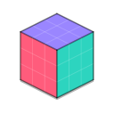

# CUBE

<p>
  
</p>

**CUBE** = **C**hrome **U**RL **B**locking **E**xtension.

A modern, privacy-first request blocker built on **Manifest V3** + Chrome’s **`declarativeNetRequest`** engine.

## What you get

- **Privacy-first defaults**: block rules enabled; optional compatibility allow rules are *off* until you opt in.
- **Fast & local**: blocking happens in Chrome’s native DNR engine (no proxy, no remote service).
- **Modern UX**: “Fix This Site” flows (temporary tab/site bypass), per-domain allow/block, and a “Recent Activity” view.
- **Transparent diagnostics**: optional local match logging via `onRuleMatchedDebug` (unpacked/dev only).

## Install (unpacked / dev)

1. Open `chrome://extensions`
2. Enable **Developer mode**
3. Click **Load unpacked**
4. Select this repo folder

## How blocking works

CUBE ships **static rulesets** (generated from filter lists) and also supports **dynamic rules** you add from the popup:

- Static rulesets (packaged, versioned):
  - `rules.json`, `rules.2.json`, `rules.3.json`, `rules.4.json` (block shards)
  - `rules.exceptions.json` (optional compatibility exceptions; disabled by default)
  - `rules.allowlist.json` (optional support-widget allowlist; disabled by default)
- Dynamic/session rules (runtime):
  - per-domain allow/block
  - scoped allows
  - temporary bypass (tab / site) to quickly make a site work

## Regenerate rulesets

Rules are generated from **Adblock Plus (ABP)-style** filter lists using Go:

```bash
go run ./tools/rulegen
```

Useful flags:

- `-blocks-shards 4` writes `rules.json`, `rules.2.json`, …
- `-max-rules 30000` caps each ruleset
- `-source name=url` adds/replaces sources (repeatable)
- `-exceptions none|scoped|all` controls `@@` exception emission into `rules.exceptions.json`
- `-builtin-allowlist=false` disables the small support-widget allowlist ruleset
- `-allow-domain example.com` adds domains to the generated allowlist ruleset (repeatable)

### Adding uBlock Origin / uAssets lists

You *can* add additional sources (including uBO-maintained lists), e.g.:

```bash
go run ./tools/rulegen \
  -source ubo_uassets=https://raw.githubusercontent.com/uBlockOrigin/uAssets/refs/heads/master/filters/filters.txt
```

But `rulegen` intentionally supports a **conservative subset** of ABP-style rules so it stays faithful to what DNR can express.

**Supported (high-level):**
- Network blocking rules for `||host^` / `||host/path` and some `|https://…` rules
- A subset of `$` options: `third-party`, `~third-party`, `domain=…`, and common resource types (`script`, `image`, `stylesheet`, `xmlhttprequest`, …)
- `@@` exception rules (per `-exceptions`)

**Not supported (examples):**
- Cosmetic filtering (`##`, `#@#`)
- Scriptlets / procedural rules / element hiding
- Redirect/replace/removeparam and other behavior-changing modifiers
- Regex filters and many advanced ABP/uBO modifiers

Unsupported lines are **skipped** on purpose (better to skip than to guess incorrectly).

## Regenerate icons

The icon set is generated (deterministically) from Go:

```bash
go run ./tools/icongen -outdir icons
```

Outputs:
- `icons/icon16.png`
- `icons/icon32.png`
- `icons/icon48.png`
- `icons/icon128.png`

## Diagnostics note

Diagnostics logging uses `declarativeNetRequest.onRuleMatchedDebug`. Per Chrome’s permission model, this is intended for **debugging/unpacked extensions**; CUBE keeps diagnostics **off by default** and stores matches **locally**.

## License

MIT — see `LICENSE`.
